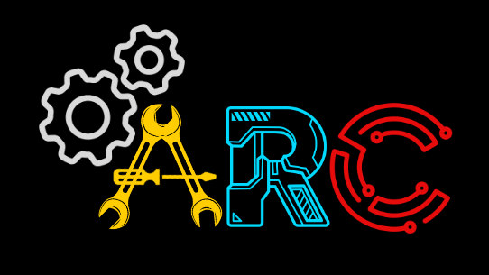

# Automation and Robotics Club
Welcome to the active workspace. This is the central directory for our current codebase, active tasks, and internal resources. 

---

## Active Projects

<table align="center">
  <tr>
    <td align="center" width="50%">
      
       
      <b> The Sims!</b>
       
      <i>Using reinforement learning to train the So100 robotic arm and Pupper</i>
    </td>
    <td align="center" width="50%">
      
       
      <b>F1 Sim Rig</b>
       
      <i>Feel the thrill and the forces of being an F1 driver by racing in a mock f1 sim rig</i>
    </td>
  </tr>
</table>

---

## ARC Resources 

>  **Under Construction** 
> 
> Arc f101 is currently being worked upon, if you want to contribute, pls contact any of the PORs.
> *Link dropping here soon.*

---
*If you are looking for a specific codebase not listed here, use the search bar above or check the full repository list.*
